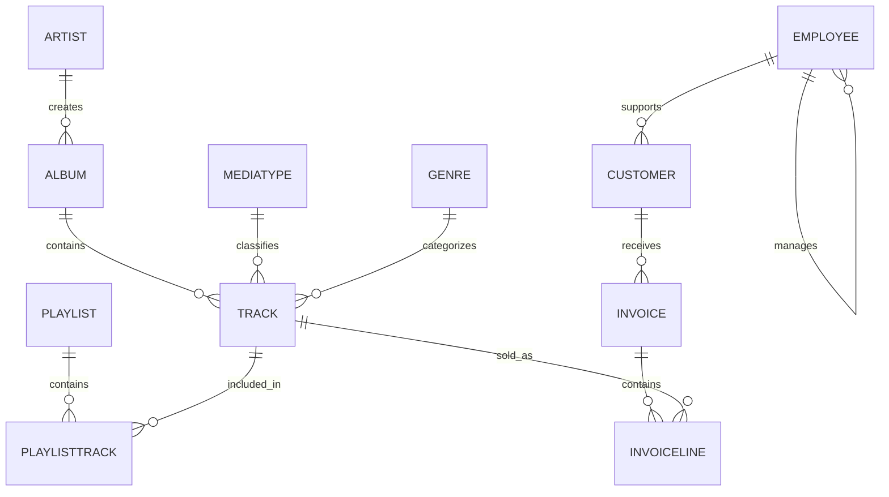

# Chinook Sample Data

This project uses the **Chinook Database** as its sample business dataset.

Chinook models a digital media store and is commonly used for demonstrations, SQL education, application testing, and ORM tooling. It was created as an alternative to Microsoft's Northwind sample database.

## Original source

The authoritative project is maintained by Luis Rocha:

- Repository: https://github.com/lerocha/chinook-database
- Releases: https://github.com/lerocha/chinook-database/releases
- License: https://github.com/lerocha/chinook-database/blob/master/LICENSE.md

The upstream project supports multiple database engines, including:

- PostgreSQL
- SQLite
- MySQL
- SQL Server
- Oracle
- DB2

This repository starts from the SQLite edition used by Docker's Compose for Agents example and imports it into PostgreSQL during local environment startup.

## Dataset version

The current project should record the exact upstream Chinook release or source commit used for `database/Chinook.db`.

At the time this documentation was prepared, the latest published upstream release was **v1.4.5**, released on February 12, 2024.

To make the sample data reproducible, update this section with one of the following:

```text
Upstream release: v1.4.5
Source asset: Chinook_Sqlite.sqlite
SHA-256: <record the checksum of database/Chinook.db>
```

Generate the checksum with:

```bash
sha256sum database/Chinook.db
```

Recording the checksum is important because database contents can affect generated SQL, expected answers, regression tests, and comparisons between AI models or prompts.

## Business domain

The data represents a digital media store with:

- Employees and reporting relationships
- Customers and their assigned support representatives
- Artists and albums
- Tracks, genres, and media types
- Playlists and playlist membership
- Customer invoices and invoice lines

The upstream project describes the sample data as follows:

- Media-related data was created from an iTunes library.
- Customer and employee records use fictitious names and well-formed contact information.
- Sales information was generated using random data over a four-year period.

Although some artist, album, and track names come from real media metadata, the database is intended for demonstration and testing rather than business analysis.

## Imported data size

The current importer loads the following 11 tables into PostgreSQL:

| Table | Rows | Purpose |
|---|---:|---|
| `album` | 347 | Albums associated with artists |
| `artist` | 275 | Music artists |
| `customer` | 59 | Store customers and assigned support representatives |
| `employee` | 8 | Employees and management hierarchy |
| `genre` | 25 | Track genres |
| `invoice` | 412 | Customer sales invoices |
| `invoiceline` | 2,240 | Individual invoice items |
| `mediatype` | 5 | Media encoding or file types |
| `playlist` | 18 | Named playlists |
| `playlisttrack` | 8,715 | Many-to-many mapping between playlists and tracks |
| `track` | 3,503 | Individual media tracks |

The import currently contains **15,607 rows** across these tables.

Row counts should be treated as version-specific. They may change if the bundled Chinook database is replaced with another upstream release.

## Schema overview



## Important relationships

### Artists, albums, and tracks

```text
artist
  └── album
        └── track
```

An artist can have multiple albums, and an album can contain multiple tracks.

### Customers and sales agents

```text
employee
  └── customer.supportrepid
        └── invoice
              └── invoiceline
```

A customer's `supportrepid` identifies the employee assigned as the customer's support representative. Questions such as “Which sales agent made the most in sales?” are usually answered by joining employees to customers through this relationship and then aggregating the customers' invoices.

The phrase “sales agent” is a business interpretation; it is not necessarily the exact employee title stored in the database. This is one reason the generated SQL and interpretation should be exposed by the engineering console.

### Employee management hierarchy

The `employee.reportsto` column is a self-reference to another employee.

This supports several different meanings of “manager”:

- An employee whose title contains `Manager`
- An employee referenced by another employee's `reportsto`
- An employee who does not report to anyone

Natural-language questions should define which meaning is intended.

### Invoices and invoice lines

An invoice contains one or more invoice lines. Depending on the question, sales totals may be calculated from:

```sql
SUM(invoice.total)
```

or:

```sql
SUM(invoiceline.unitprice * invoiceline.quantity)
```

A validation test should record which business definition is expected. Differences in joins, date filters, or aggregation rules can produce different answers even when the generated SQL is syntactically correct.

## Inspecting the schema

Connect with DBeaver using the local PostgreSQL configuration described in the main README.

List imported tables:

```sql
SELECT table_name
FROM information_schema.tables
WHERE table_schema = 'public'
  AND table_type = 'BASE TABLE'
ORDER BY table_name;
```

Inspect columns:

```sql
SELECT
    table_name,
    column_name,
    data_type,
    is_nullable
FROM information_schema.columns
WHERE table_schema = 'public'
ORDER BY table_name, ordinal_position;
```

Verify row counts:

```sql
SELECT 'album' AS table_name, COUNT(*) AS row_count FROM album
UNION ALL
SELECT 'artist', COUNT(*) FROM artist
UNION ALL
SELECT 'customer', COUNT(*) FROM customer
UNION ALL
SELECT 'employee', COUNT(*) FROM employee
UNION ALL
SELECT 'genre', COUNT(*) FROM genre
UNION ALL
SELECT 'invoice', COUNT(*) FROM invoice
UNION ALL
SELECT 'invoiceline', COUNT(*) FROM invoiceline
UNION ALL
SELECT 'mediatype', COUNT(*) FROM mediatype
UNION ALL
SELECT 'playlist', COUNT(*) FROM playlist
UNION ALL
SELECT 'playlisttrack', COUNT(*) FROM playlisttrack
UNION ALL
SELECT 'track', COUNT(*) FROM track
ORDER BY table_name;
```

## Import process

The project stores the SQLite database under `database/` and imports it through the `importer` Compose service.

The importer:

1. Waits until PostgreSQL reports healthy.
2. Runs `pgloader`.
3. Creates the PostgreSQL tables, indexes, primary keys, and foreign keys.
4. Copies the sample data.
5. Exits successfully.
6. Allows the MCP Gateway and Spring Boot application to start.

Removing the PostgreSQL volume causes the data to be imported again:

```bash
docker compose \
  -f compose.yaml \
  -f compose.openai.yaml \
  down -v
```

## License and attribution

The upstream Chinook Database is distributed under the MIT License.

Copyright:

```text
Copyright (c) 2008-2024 Luis Rocha
```

The upstream copyright notice and license should be retained with redistributed copies or substantial portions of the database and associated scripts.

This project should include an attribution file or third-party notices section when the sample database is redistributed.

Suggested repository location:

```text
THIRD_PARTY_NOTICES.md
```

## Why Chinook is useful for this project

Chinook is well suited to natural-language-to-SQL validation because it includes:

- A recognizable business domain
- Multiple related tables
- One-to-many and many-to-many relationships
- Employee hierarchy
- Customer assignment to employees
- Transaction headers and line items
- Dates, monetary values, and aggregates
- Questions with potentially ambiguous business terminology

These characteristics make it useful for testing not only SQL generation, but also interpretation, evidence tracking, determinism, and business-rule validation.
